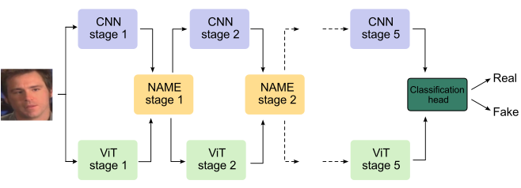
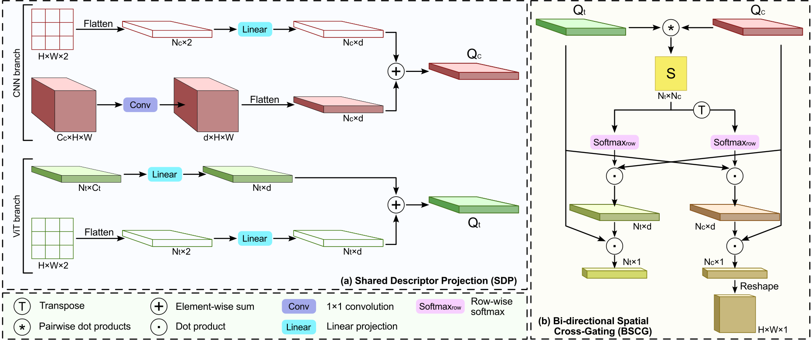
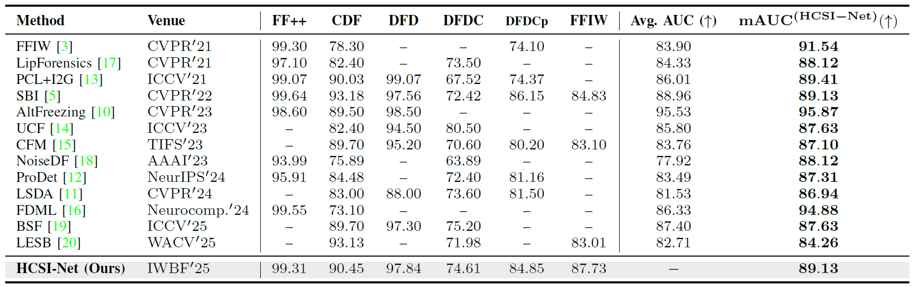

# HCSI-Net

[](https://ieeexplore.ieee.org/abstract/document/11558171)
[](https://github.com/markobrodaric/HCSI-Net/releases/tag/v0.1.0)


Official PyTorch implementation of **HCSI-Net**, a two-stream CNN-Transformer deepfake detector designed for robust cross-dataset generalization.

HCSI-Net couples local texture modeling from a CNN stream with global contextual reasoning from a transformer stream. The two streams interact hierarchically through bi-directional spatial cross-gating, allowing the network to jointly refine fine-grained manipulation artifacts and high-level semantic cues.

> **Paper:** HCSI-Net: Hierarchical Cross-Stream Interaction for Generalizable Deepfake Detection
> **Venue:** Proceedings of the International Workshop on Biometrics and Forensics, IWBF 2026
> **Authors:** Marko Brodarič, Marija Ivanovska, Deepak Kumar Jain, Peter Peer, Vitomir Štruc
> **Links:** [IEEE Xplore](https://ieeexplore.ieee.org/abstract/document/11558171) · [Pretrained weights](https://github.com/markobrodaric/HCSI-Net/releases/tag/v0.1.0)

---

## Overview

<p align="center">
  
</p>

HCSI-Net is designed for generalizable deepfake detection under distribution shifts caused by unseen manipulation methods, post-processing operations, and challenging capture conditions.

The method combines:

* a **CNN stream** for local artifact and texture representation,
* a **Transformer stream** for global contextual reasoning,
* **hierarchical cross-stream interaction** across multiple feature stages,
* **bi-directional spatial cross-gating** for progressive information exchange,
* manipulation-agnostic training based on simulated forgery artifacts.

---

## Architecture

<p align="center">
  
</p>

HCSI-Net integrates an EfficientNet-based CNN backbone with a Swin Transformer backbone. Intermediate features from both streams are exchanged through cross-stream interaction modules, allowing the detector to leverage complementary local and global cues.

---

## Repository Structure

```text
HCSI-Net/
├── models/
│   ├── architecture/
│   │   └── HCSINet.py
│   └── backbones/
│       ├── EfficientNet/
│       └── Swin/
├── config.py
├── main.py
├── train.py
├── test.py
├── README.md
└── LICENSE
```

---

## Installation

Clone the repository:

```bash
git clone https://github.com/markobrodaric/HCSI-Net.git
cd HCSI-Net
```

Create and activate a Python environment:

```bash
python -m venv venv
source venv/bin/activate
```

Install the required dependencies:

```bash
pip install torch torchvision torchaudio
pip install numpy opencv-python scikit-learn tqdm matplotlib
pip install retina-face
```

Depending on your CUDA/PyTorch setup, install PyTorch using the command recommended on the official PyTorch website.

---

## Pretrained Weights

Pretrained HCSI-Net weights are available from the GitHub Releases page:

[Download pretrained weights](https://github.com/markobrodaric/HCSI-Net/releases/tag/v0.1.0)

To download them with the GitHub CLI:

```bash
mkdir -p weights
gh release download v0.1.0 --repo markobrodaric/HCSI-Net -D weights
```

Expected checkpoint path:

```text
weights/HCSI_pretrained.pth
```

You can also download the file manually from the release page and place it inside the `weights/` directory.

---

## Dataset Configuration

Before training or evaluation, update the dataset paths in `config.py`:

```python
dataset_paths = DatasetPaths(
    faceforensics_root="/path/to/FaceForensics++",
    dfd_real_dir="/path/to/DFD/original_sequences/actors/raw/videos",
    dfd_fake_dir="/path/to/DFD/fake/videos",
    dfdc_root="/path/to/DFDC",
    cdf_root="/path/to/CDF",
    dfdcp_root="/path/to/DFDCP/dfdc_preview_set",
    ffiw_root="/path/to/FFIW/FFIW-test/FFIW10K-v1-release-test",
)
```

Supported evaluation datasets include:

* FaceForensics++,
* DeepFakeDetection,
* DFDC,
* Celeb-DF,
* FFIW,
* DFDCP.

---

## Evaluation

After downloading the pretrained weights and configuring the dataset paths, run:

```bash
python main.py
```

By default, the checkpoint is loaded from:

```text
weights/HCSI_pretrained.pth
```

Evaluation results are saved in:

```text
results/
```

To evaluate on a specific dataset, modify the `datasets` argument in `main.py`:

```python
results = test_cross_dataset(
    model=model,
    datasets="CDF",
    test_name="hcsi_cross_dataset_eval",
    dataset_paths=c.dataset_paths,
    image_size=c.image_size,
    num_classes=c.num_classes,
)
```

Use `"all"` to evaluate on all supported datasets:

```python
datasets="all"
```

---

## Training

The training script uses Self-Blended Images for manipulation-agnostic supervision.

To train HCSI-Net, configure the SBI data path and run:

```bash
python main.py
```

Training checkpoints are saved under:

```text
weights/training/
```

Training visualizations are saved under:

```text
visualisations/
```

---

## Results

<p align="center">
  
</p>

Please refer to the paper for the full experimental protocol, cross-dataset evaluation setup, ablation studies, and comparison with state-of-the-art deepfake detectors.

---

## Citation

If you use this code or the pretrained weights in your research, please cite:

```bibtex
@INPROCEEDINGS{brodaric2026hcsinet,
  author={Brodarič, Marko and Ivanovska, Marija and Jain, Deepak Kumar and Peer, Peter and Štruc, Vitomir},
  booktitle={2026 14th International Workshop on Biometrics and Forensics (IWBF)}, 
  title={HCSI-Net: Hierarchical Cross-Stream Interaction for Generalizable Deepfake Detection}, 
  year={2026},
  volume={},
  number={},
  pages={1-6},
  keywords={Timing;Modeling;Deepfakes;Equations;Streams;Convolutional neural networks;Detectors;Printing;Signal detection;Forgery;Deepfake detection;cross-dataset generalization;two-stream networks;CNN-Transformer fusion},
  doi={10.1109/IWBF68042.2026.11558171}}

```

---

## License

This project is released under the [MIT License](LICENSE).


## Contact

For questions, issues, or suggestions, please contact the corresponding author: Marko Brodarič, marko.brodaric@fe.uni-lj.si
